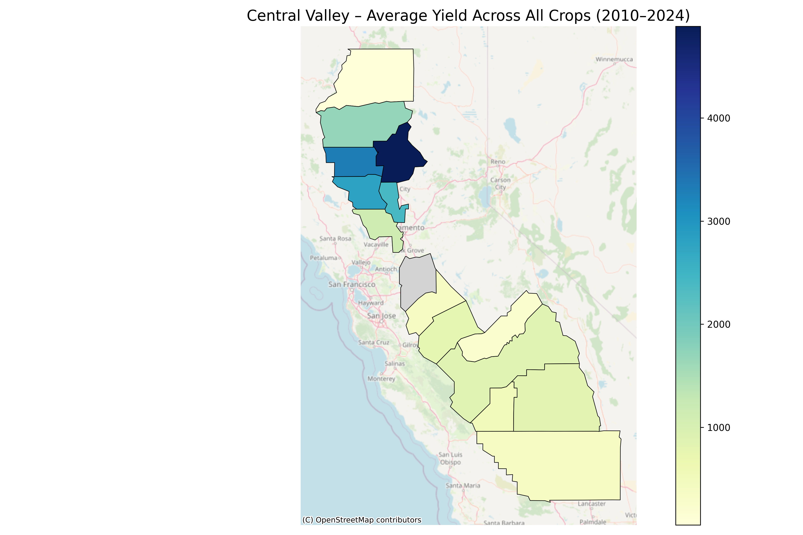

# Climate and Crop Yield Modeling in California's Central Valley



This map shows average crop yield across California's Central Valley (2010–2024), visualized by county and layered on an OpenStreetMap basemap. It reflects aggregated yields from multiple USDA commodities. Elevation and terrain differences between the valley floor and surrounding Sierra Nevada range provide additional geographic context.

---

## Key Findings

- Corn yield is highly heat-sensitive: -26% yield loss in hot years.
- Beans and wheat show yield increases in hot years (+13% and +12%).
- Barley shows the steepest yield loss in hot years: -50%.
- Most crops showed mild-to-moderate yield changes under elevated temperatures.

---

## Project Overview

This project investigates the relationship between climate trends and agricultural productivity across 15 counties in California's Central Valley, using data from 2010 to 2024.

The goal is to quantify:

- How temperature and precipitation affect yield across crops
- Which counties and crops are most climate-vulnerable
- What predictive modeling can tell us about future yield patterns

---

## Data & Methodology

### Sources

- USDA NASS QuickStats API: Yield, area harvested/planted, production
- NOAA Climate Data Online (CDO) API: Daily TMAX, TMIN, PRCP
- Census TIGER/Line County Boundaries (via GeoJSON)

### Processing Steps

1. *Daily Weather Data → Yearly Aggregates*
   - Features: tmax_mean, tmin_mean, prcp_total
   - Missing values imputed via KNN across nearby counties

2. *Crop Data Cleaning*
   - All crops with YIELD or PRODUCTION data retained
   - Combined into per-crop files like corn.csv, wheat.csv

3. *Feature Engineering*
   - Merged on county + year
   - Final features: Climate + Area Planted/Harvested + Yield

4. *Modeling*
   - Random Forest Regression for each crop
   - Metrics saved to per-crop reports

---

## Modeling Results

| Crop     | R² Score | MAE     | Top Features                    |
|----------|----------|---------|---------------------------------|
| Corn     | 0.675    | 28.43   | prcp_total, area_harvested      |
| Beans    | 0.614    | 292.16  | area_harvested, tmin_mean       |
| Wheat    | 0.269    | 14.69   | tmax_mean, area_harvested       |
| Cotton   | 0.165    | 167.81  | prcp_total, production          |
| Tomatoes | -0.063   | 4.74    | mostly flat yield trends        |
| Rice     | -1.05    | 540.84  | noisy, climate-agnostic yields  |
| Barley   | -0.29    | 8.50    | small sample (11 rows)          |

---

## Climate Stress Impact (Hot-Year Analysis)

| Crop     | Normal Yield | Hot-Year Yield | Change (bu/acre) | % Change | Hot Years |
|----------|---------------|----------------|------------------|----------|-----------|
| Corn     | 76.85         | 56.62          | -20.23           | -26.32%  | 15        |
| Barley   | 72.2          | 36.0           | -36.2            | -50.14%  | 2         |
| Beans    | 2411.72       | 2730.0         | +318.28          | +13.2%   | 3         |
| Wheat    | 78.41         | 87.85          | +9.44            | +12.04%  | 11        |
| Tomatoes | 48.37         | 51.16          | +2.79            | +5.77%   | 17        |
| Cotton   | 1584.8        | 1535.64        | -49.16           | -3.1%    | 7         |
| Rice     | 8529.35       | 8582.86        | +53.51           | +0.63%   | 7         |

---

## Repository Structure

```
project-root/
├── data/
│   ├── raw/ # USDA & NOAA raw data
│   └── processed/ # Final features and merged files
│       └── by_crop/ # One file per crop
├── results/
│   ├── yield_models/ # Per-crop model metrics & plots
│   └── climate_trends/ # Hot year impact plots and tables
├── src/ # All scripts
└── README.md

## Reproducibility

To recreate this project:

```bash
# 1. Download raw USDA & NOAA data
python src/data_collection.py

# 2. Feature engineer & impute
python src/feature_engineering.py

# 3. Merge with USDA crop data
python src/merge_ag_climate.py

# 4. Build per-crop datasets
python src/build_crop_specific_datasets.py

# 5. Train crop models
python src/model_crop_yield.py

# 6. Analyze hot-year impacts
python src/climate_trend_analysis.py

# 7. Create final map
python src/generate_yield_map.py
```

## Final Notes
-Crop modeling across 15 counties and 8+ crops

-Predictive modeling + climate trend interpretation

-Visuals, metrics, and ready-to-run pipeline for others to extend

-Built for transparency, climate awareness, and applied data science in food systems